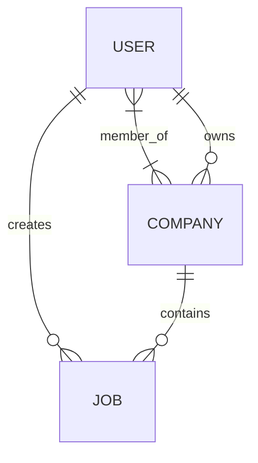

# Job Platform

A Laravel-based job platform with a REST API, Vue 3 frontend, user authentication, company and job management, and a separate administrator API.

The project was developed as a case-study application with a focus on clear separation of responsibilities, authorization through policies, validated API input, repository-based data access, automated tests, and reproducible local development.

---

## Table of Contents

* [Features](#features)
* [Tech Stack](#tech-stack)
* [Architecture](#architecture)
* [Domain Model](#domain-model)
* [Business Rules](#business-rules)
* [Authentication--Authorization](#authentication--authorization)
* [API](#api)
* [Database Design](#database-design)
* [Frontend](#frontend)
* [Project Structure](#project-structure)
* [Requirements](#requirements)
* [Installation](#installation)
* [Running the Application](#running-the-application)
* [Development Accounts](#development-accounts)
* [Testing](#testing)
* [Useful Commands](#useful-commands)
* [Design Decisions](#design-decisions)
* [Case Study Mapping](#case-study-mapping)
* [Security Notes](#security-notes)
* [Status](#status)

---

## Features

### Users

* User registration and authentication
* Laravel Sanctum API authentication
* View own profile
* Update own profile
* Delete own account
* Users cannot manage other users
* User-to-company many-to-many memberships
* Users can create and manage their own jobs

### Companies

* Public company listing and details
* Authenticated users can create companies
* Company creator becomes the owner
* Company ownership can be changed by an administrator
* Users can belong to multiple companies
* Companies can have multiple users and jobs
* Company owners can update and delete their companies
* Company deletion removes its jobs first

### Jobs

* Public job listing and details
* Authenticated job creation
* Jobs belong to a company
* Jobs have a creator
* Job creators are automatically added to the company
* Normal users can update and delete their own jobs
* Normal users cannot change a job's company or creator
* Administrators can manage all jobs
* Administrators can change both the company and creator of a job
* When an administrator moves a job to another company, the job creator is added to that company's members

### Administration

The application provides a separate administrator authentication flow.

Administrators can:

* View their own administrator profile
* Update their own administrator profile
* Manage users
* Manage jobs
* Manage companies

---

## Tech Stack

### Backend

* PHP
* Laravel
* Laravel Sanctum
* Eloquent ORM
* Pest / PHPUnit
* SQLite for local development

### Frontend

* Vue 3
* TypeScript
* Inertia.js
* Tailwind CSS
* Vite

---

## Architecture

The backend follows a clear separation of responsibilities:

```text
HTTP Request
     |
     v
Form Request
     |
     v
Controller
     |
     v
Policy
     |
     v
Repository
     |
     v
Eloquent Model / Database
     |
     v
API Resource
     |
     v
JSON Response
```

### Form Requests

Form Requests handle HTTP input validation.

Examples include:

* `AdminLoginRequest`
* `CreateUserRequest`
* `UpdateUserRequest`
* `StoreCompanyRequest`
* `UpdateCompanyRequest`
* `StoreJobRequest`
* `UpdateJobRequest`
* `CreateJobRequest`
* `UpdateJobRequest`

This keeps validation logic out of controllers.

### Controllers

Controllers coordinate the request lifecycle without containing unnecessary database logic.

```text
app/Http/Controllers/
├── AdminController.php
├── AuthController.php
├── CompanyController.php
├── JobController.php
└── UserController.php
```

### Policies

Authorization is handled through Laravel policies.

```text
app/Policies/
├── AdminPolicy.php
├── CompanyPolicy.php
├── JobPolicy.php
└── UserPolicy.php
```

### Repositories

Repositories contain database and domain operations that would otherwise make controllers unnecessarily complex.

```text
app/Repositories/
├── AdminRepository.php
├── CompanyRepository.php
├── JobRepository.php
└── UserRepository.php
```

Repositories also handle relationship-related operations such as company membership and job ownership synchronization where required.

### API Resources

API Resources define the structure of API responses.

```text
app/Http/Resources/
├── CompanyResource.php
├── JobResource.php
└── UserResource.php
```

---

## Domain Model

The application has three main domain models plus a separate administrator model.

```text
User
 ├── belongsToMany → Company
 └── hasMany       → Job

Company
 ├── belongsToMany → User
 ├── belongsTo     → User (owner)
 └── hasMany       → Job

Job
 ├── belongsTo     → Company
 └── belongsTo     → User (creator)

Admin
 └── independent authentication model
```

### Entity Relationship Diagram



The `User ↔ Company` many-to-many relationship is implemented through the `company_user` pivot table.

---

## Business Rules

### Users

* Users authenticate through Laravel Sanctum.
* Users can view, update, and delete their own account.
* Users cannot view or modify other users through the normal user API.
* User listing is disabled for normal users.
* Administrators can manage users through the administrator API.

### Companies

* Authenticated users can create companies.
* The company creator becomes the owner.
* The company creator is also added as a company member.
* A company can have multiple members.
* A user can belong to multiple companies.
* A company can have multiple jobs.
* Company IDs are immutable.
* Normal users cannot change company ownership.
* Administrators can change `owner_id`.
* When an owner is assigned by an administrator, that user is also added to the company.
* Company deletion removes its jobs before deleting the company.

### Jobs

* Every job belongs to a company.
* Every job has a creator represented by `user_id`.
* When a normal user creates a job, the authenticated user becomes its creator.
* The creator is automatically added to the job's company.
* Normal users can update and delete their own jobs.
* Normal users cannot change `company_id` or `user_id`.
* Administrators can change both `company_id` and `user_id`.
* If an administrator moves a job to another company, the job creator is added to the new company.
* Job IDs are immutable.

---

## Authentication & Authorization

Laravel Sanctum is used for API authentication.

### Normal Users

Normal user tokens receive the:

```text
user
```

ability.

Protected requests use:

```http
Authorization: Bearer <token>
```

Normal user routes require:

```text
auth:sanctum
abilities:user
```

### Administrators

Administrator tokens receive the:

```text
admin
```

ability.

Administrator routes require:

```text
auth:sanctum
abilities:admin
```

This creates a clear authorization boundary between normal users and administrators.

### Access Model

```text
Normal User Token
       |
       +----> Normal User API     ✓
       |
       +----> Admin API           ✗


Admin Token
       |
       +----> Admin API           ✓
       |
       +----> Normal User API     ✗
```

The token ability behavior is covered by the automated test suite.

---

## API

All API routes are prefixed with:

```text
/api
```

### Authentication

| Method | Endpoint       | Access             |
| ------ | -------------- | ------------------ |
| `POST` | `/login`       | Public             |
| `POST` | `/admin/login` | Public             |
| `GET`  | `/user`        | Authenticated user |

---

### Jobs

| Method      | Endpoint      | Access |
| ----------- | ------------- | ------ |
| `GET`       | `/jobs`       | Public |
| `GET`       | `/jobs/{job}` | Public |
| `POST`      | `/jobs`       | User   |
| `PUT/PATCH` | `/jobs/{job}` | User   |
| `DELETE`    | `/jobs/{job}` | User   |

Normal users can only update or delete jobs they are authorized to manage.

---

### Companies

| Method      | Endpoint               | Access |
| ----------- | ---------------------- | ------ |
| `GET`       | `/companies`           | Public |
| `GET`       | `/companies/{company}` | Public |
| `POST`      | `/companies`           | User   |
| `PUT/PATCH` | `/companies/{company}` | User   |
| `DELETE`    | `/companies/{company}` | User   |

Company modification is controlled by `CompanyPolicy`.

---

### Users

Registration is public:

| Method | Endpoint | Access |
| ------ | -------- | ------ |
| `POST` | `/users` | Public |

Authenticated user operations:

| Method      | Endpoint        | Access |
| ----------- | --------------- | ------ |
| `GET`       | `/users/{user}` | User   |
| `PUT/PATCH` | `/users/{user}` | User   |
| `DELETE`    | `/users/{user}` | User   |

Normal users are restricted to their own account by `UserPolicy`.

---

## Administrator API

All administrator routes require:

```text
auth:sanctum
abilities:admin
```

### Administrator Profile

| Method      | Endpoint         |
| ----------- | ---------------- |
| `GET`       | `/admin/{admin}` |
| `PUT/PATCH` | `/admin/{admin}` |

### Users

| Method   | Endpoint              |
| -------- | --------------------- |
| `GET`    | `/admin/users`        |
| `GET`    | `/admin/users/{user}` |
| `POST`   | `/admin/users`        |
| `PUT`    | `/admin/users/{user}` |
| `DELETE` | `/admin/users/{user}` |

### Jobs

| Method   | Endpoint            |
| -------- | ------------------- |
| `GET`    | `/admin/jobs`       |
| `GET`    | `/admin/jobs/{job}` |
| `POST`   | `/admin/jobs`       |
| `PUT`    | `/admin/jobs/{job}` |
| `DELETE` | `/admin/jobs/{job}` |

### Companies

| Method   | Endpoint                     |
| -------- | ---------------------------- |
| `GET`    | `/admin/companies`           |
| `GET`    | `/admin/companies/{company}` |
| `POST`   | `/admin/companies`           |
| `PUT`    | `/admin/companies/{company}` |
| `DELETE` | `/admin/companies/{company}` |

The administrator profile resource is registered after the more specific administrator management routes to avoid route collisions.

---

## Database Design

### Users

The `users` table contains:

* `id`
* `name`
* `email`
* `email_verified_at`
* `password`
* `remember_token`
* timestamps

### Companies

The `companies` table contains:

* `id`
* `name`
* `description`
* `website`
* `owner_id`
* timestamps

`owner_id` references the owning user and is nullable.

### Jobs

The `jobs` table contains:

* `id`
* `company_id`
* `user_id`
* `title`
* `description`
* `location`
* timestamps

Foreign key behavior:

* Deleting a company is restricted while jobs exist.
* Deleting a user sets their jobs' `user_id` to `NULL`.

### Company Membership

The `company_user` pivot table contains:

* `company_id`
* `user_id`
* timestamps

The `(company_id, user_id)` pair is unique.

Membership records are removed when either related user or company is deleted.

### Administrators

The `admins` table contains:

* `id`
* `name`
* `password`
* `remember_token`
* timestamps

---

## Frontend

The frontend is built with:

* Vue 3
* Inertia.js
* TypeScript
* Tailwind CSS
* Vite

### Main Pages

* Welcome / Entry
* Login
* Registration
* Public job browsing
* Job details
* Public company browsing
* Company details
* Company jobs
* User profile
* Network
* Settings
* Create job
* Edit job
* Create company
* Edit company

### Administrator Pages

* Administrator login
* Administrator dashboard
* User management
* Company management
* Job management

### Navigation

Authenticated users use:

```text
resources/js/components/AuthNav.vue
```

Main navigation:

```text
Search | Create | Network | Profile | Settings
```

The administrator interface uses:

```text
resources/js/components/AdminNav.vue
```

### Frontend Organization

Public pages:

```text
resources/js/pages/public/
```

Authenticated pages:

```text
resources/js/pages/auth/
```

Administrator pages:

```text
resources/js/pages/admin/
```

Reusable components:

```text
resources/js/components/
```

Frontend route definitions:

```text
resources/js/routes/
resources/js/wayfinder/
```

Authentication tokens are stored in browser `localStorage` and sent as Bearer tokens for protected API requests.

---

## Project Structure

```text
app/
├── Http/
│   ├── Controllers/
│   ├── Middleware/
│   └── Resources/
├── Models/
├── Policies/
├── Providers/
└── Repositories/

database/
├── factories/
├── migrations/
└── seeders/

resources/
└── js/
    ├── components/
    ├── lib/
    ├── pages/
    │   ├── admin/
    │   ├── auth/
    │   └── public/
    ├── routes/
    ├── types/
    └── wayfinder/

routes/
├── api.php
├── console.php
└── web.php

tests/
├── Feature/
└── Unit/
```

---

## Requirements

Make sure the following are installed:

* PHP
* Composer
* Node.js
* npm
* SQLite or another supported database
* Git

---

## Installation

### 1. Clone the repository

```bash
git clone <repository-url>
cd job-platform
```

Replace `<repository-url>` with the URL of your GitHub repository.

### 2. Install PHP dependencies

```bash
composer install
```

### 3. Install frontend dependencies

```bash
npm install
```

### 4. Create the environment file

```bash
cp .env.example .env
```

### 5. Generate the application key

```bash
php artisan key:generate
```

### 6. Configure SQLite

Create the SQLite database:

```bash
touch database/database.sqlite
```

Then make sure `.env` contains:

```env
DB_CONNECTION=sqlite
```

### 7. Run migrations and seed the database

For a fresh development installation:

```bash
php artisan migrate:fresh --seed
```

This creates the database structure and development data.

---

## Running the Application

Start the Laravel development server:

```bash
php artisan serve
```

In a second terminal, start the Vite development server:

```bash
npm run dev
```

For a production frontend build:

```bash
npm run build
```

---

## Development Accounts

The database seeder creates predictable development accounts.

### Normal User

```text
Email:    test@example.com
Password: password
```

### Administrator

```text
Name:     admin
Password: password
```

These credentials are intended for local development and testing only.

Do not use them in production.

---

## Database Seeding

The project includes both predictable and randomly generated development data.

Running:

```bash
php artisan migrate:fresh --seed
```

creates:

* 1 administrator
* 1 known test user
* 1 known test company
* 1 known test job
* 5 additional users
* 5 additional companies
* 5 additional jobs

The predictable records make manual testing easier, while the additional records provide realistic development data.

---

## Testing

The project contains feature and unit tests covering authentication, authorization, token abilities, users, companies, jobs, and administrator functionality.

Run the complete test suite:

```bash
php artisan test
```

Feature tests include:

```text
tests/Feature/
├── AdminApiTest.php
├── AdminPolicyTest.php
├── AuthApiTest.php
├── CompanyPolicyTest.php
├── JobPolicyTest.php
├── TokenAbilityTest.php
└── UserPolicyTest.php
```

Unit tests are located under:

```text
tests/Unit/
```

---

## Useful Commands

### Run Tests

```bash
php artisan test
```

### Run Migrations

```bash
php artisan migrate
```

### Rebuild and Seed the Database

```bash
php artisan migrate:fresh --seed
```

### List Registered Routes

```bash
php artisan route:list
```

### Start Laravel

```bash
php artisan serve
```

### Start Vite

```bash
npm run dev
```

### Build Frontend Assets

```bash
npm run build
```

### Format PHP Code

```bash
vendor/bin/pint
```

---

## Validation

API input is validated through dedicated Form Request classes.

### User Registration

```text
name       required, string, max 255
email      required, valid email, unique
password   required, minimum 8 characters
```

### Company Creation

```text
name        required, string, max 255
description optional
website     optional, valid URL
```

### Normal User Job Creation

```text
company_id  required, existing company
title       required, string, max 255
description optional
location    optional, max 255
```

Normal-user job updates intentionally do not accept:

```text
company_id
user_id
```

Those relationships cannot be changed by normal users.

Administrator job creation and updates can provide both `company_id` and `user_id`.

---

## Design Decisions

### Separate Administrator Authentication

Administrators are represented by a dedicated `Admin` model and `admins` table instead of sharing the normal user model.

This creates a clear separation between normal application accounts and administrative access.

Sanctum abilities provide an additional authorization boundary:

```text
user token  → normal user API
admin token → administrator API
```

### Policies for Authorization

Authorization decisions are kept in policies rather than being scattered throughout controllers.

For example, the rule that a normal user may only modify their own job is handled by `JobPolicy`.

### Form Requests for Validation

HTTP validation is handled by dedicated Form Request classes.

This keeps controllers focused on application flow rather than validation details.

### Repositories for Data Operations

Repositories encapsulate database operations and relationship synchronization.

This is particularly useful for administrator operations involving multiple related models, such as changing a job's company or creator.

### API Resources

API Resources control the JSON representation returned by the API.

Relationships are explicitly loaded where required so API responses contain the data expected by the frontend.

### Public Read Access

Jobs and companies can be browsed without authentication.

Write operations require an authenticated user, while administrator operations require an administrator token.

### Company Membership

Company membership is separate from company ownership.

A user can belong to a company without owning it.

When a user creates a company, they become both:

```text
Owner
Member
```

---

## Case Study Mapping

| Requirement        | Implementation                                 |
| ------------------ | ---------------------------------------------- |
| Job model          | `app/Models/Job.php`                           |
| Job controller     | `app/Http/Controllers/JobController.php`       |
| Job policy         | `app/Policies/JobPolicy.php`                   |
| Job repository     | `app/Repositories/JobRepository.php`           |
| Company model      | `app/Models/Company.php`                       |
| Company controller | `app/Http/Controllers/CompanyController.php`   |
| Company policy     | `app/Policies/CompanyPolicy.php`               |
| Company repository | `app/Repositories/CompanyRepository.php`       |
| User model         | `app/Models/User.php`                          |
| User controller    | `app/Http/Controllers/UserController.php`      |
| User policy        | `app/Policies/UserPolicy.php`                  |
| User repository    | `app/Repositories/UserRepository.php`          |
| Authentication     | Laravel Sanctum                                |
| Request validation | Laravel Form Requests                          |
| API representation | Laravel API Resources                          |
| Authorization      | Laravel Policies + Sanctum abilities           |
| Automated tests    | `tests/Feature` and `tests/Unit`               |
| Frontend           | Vue 3 + Inertia + TypeScript + Tailwind + Vite |
| Administration     | Separate `Admin` model and API                 |

---

## Security Notes

The credentials included in the seeders are development credentials only.

Before deploying to production:

* Replace all development passwords.
* Configure a production database.
* Configure the production environment correctly.
* Use HTTPS.
* Do not commit sensitive `.env` values.
* Review Sanctum token lifetime and authentication requirements.
* Review administrator access and credentials.

---

## Status

The application currently includes:

* User authentication
* User registration and profile management
* Company management
* Company membership and ownership
* Job management
* Job ownership and creator management
* Separate administrator authentication
* Administrator CRUD operations
* Sanctum token abilities
* Policy-based authorization
* Form Request validation
* Repository-based data operations
* API Resources
* Vue/Inertia frontend
* Administrator frontend
* Database seeders
* Automated feature and unit tests

The project is structured so that the main business rules are explicit and responsibilities remain separated between requests, controllers, policies, repositories, models, and resources.
