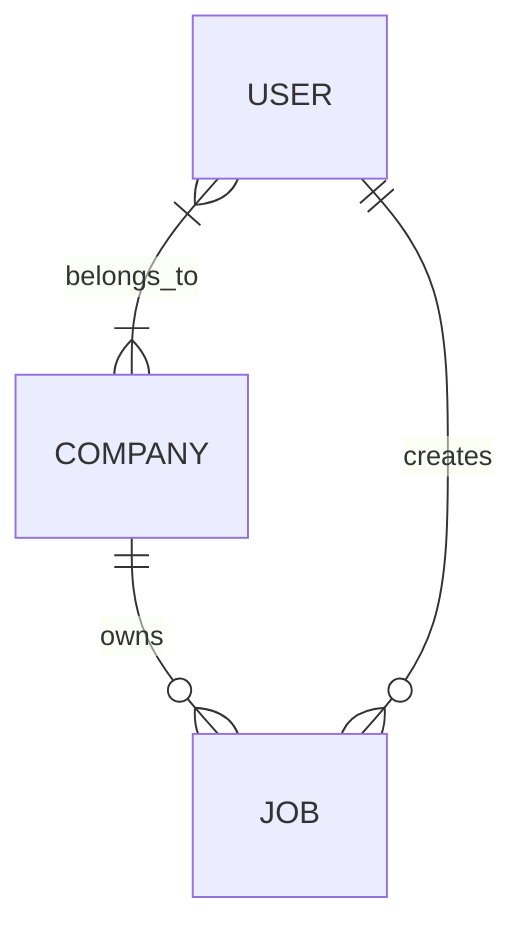

# Job Platform — Case Study

## Concept

A Laravel/PHP backend API for managing job listings.

---

## Features

### 1. Job Management

The platform manages multiple job listings.

* **Model:** `Job.php`
* **Controller:** `JobController.php`
* **Policy:** `JobPolicy.php`
* **Repository:** `JobRepository.php` *(if needed)*

### 2. Company Management

Each job belongs to one company, while a company can have multiple jobs.

* **Model:** `Company.php`
* **Controller:** `CompanyController.php` 
* **Policy:** `CompanyPolicy.php`
* **Repository:** `CompanyRepository.php` *(if needed)*

### 3. User Management

A company can have multiple users, and a user can belong to multiple companies.

* **Model:** `User.php`
* **Controller:** `UserController.php`
* **Policy:** `UserPolicy.php`
* **Repository:** `UserRepository.php` *(if needed)*

---

## Domain Model

### Main Models

```text
User
Company
Job
```

### Relationships

```text
User ↔ Company = many-to-many
Company → Job = one-to-many
Job → Company = many-to-one
User → Job = one-to-many (created jobs)
Job → User = many-to-one (creator)
```

### Overview





The `User ↔ Company` many-to-many relationship will be implemented using a `company_user` pivot table.

---

## Domain Interpretation

* **User** = authenticated account using the platform
* **Company** = employer / organization
* **Job** = job listing owned by a company

A company owns and publishes a job listing, while `created_by` identifies the authenticated user who created the 
listing.

This distinction allows the application to determine both:

* which company owns a job
* which user created the job

---

##  Architecture Decisions

**Company Controller**

The case study references `JobController.php`in the Company section.
For the implementation, `CompanyController.php`is used instead.

Jobs and Companies are treated as independent API resources and therefore have separate resource controllers:

Job 	-> JobController
Company -> CompanyController
User 	-> UserController

This keeps the responsibilities of each controller clear and follows the RESTful resource-controller structure 
requested by the case study.

**Queue Configuration**

Laravel's default database queue uses a database table named `jobs`.

The application also requires a `jobs`table for job listings, which would create a conflict.

Since asynchronous queue processing is not required for the inital application, the queue connection is configured 
to use:

QUEUE_CONNECTION=sync

The default Laravel database queue migration is therefore not used.

If asynchronous background jobs become necessary later, the queue implementation can be revisted wihtout changing
 the Job Listing domain model.

**Repositories**

Repositories are considered optional and will only be introduced where they provide a clear benefit.

---

## Initial Development Focus

The initial implementation will focus on:

1. Database structure and migrations
2. Eloquent models and relationships
3. Authentication
4. Authorization using policies
5. Request validation
6. RESTful API endpoints
7. Automated tests

Optional frontend functionality will be considered after the required backend functionality is complete.
