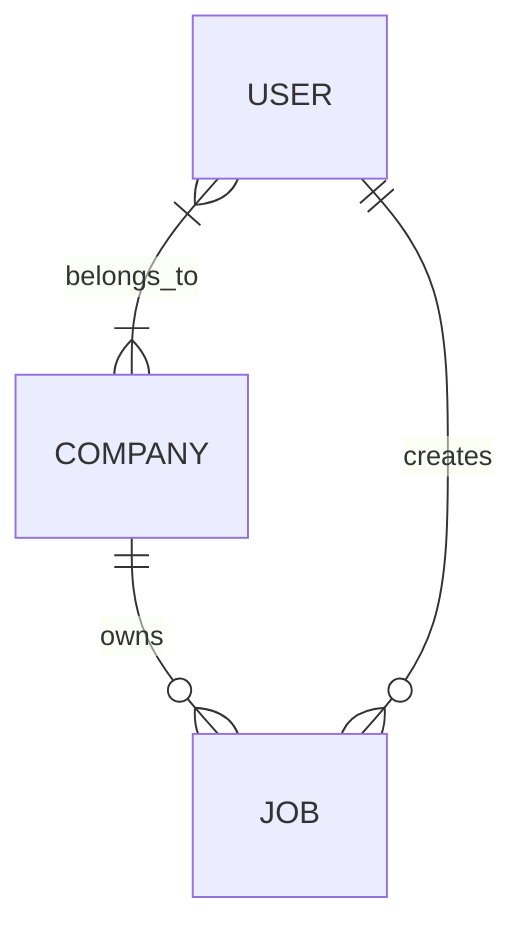

# Job Platform — Case Study

## Concept

A Laravel/PHP backend API for managing job listings.

---

## Features

### 1. Job Management

The platform manages multiple job listings.

* **Model:** `Job.php`
* **Controller:** `JobController.php`
* **Policy:** `JobPolicy.php`
* **Repository:** `JobRepository.php` *(if needed)*

### 2. Company Management

Each job belongs to one company, while a company can have multiple jobs.

* **Model:** `Company.php`
* **Controller:** `CompanyController.php` *(case study specifies `JobController.php`)* 
* **Policy:** `CompanyPolicy.php`
* **Repository:** `CompanyRepository.php` *(if needed)*

### 3. User Management

A company can have multiple users, and a user can belong to multiple companies.

* **Model:** `User.php`
* **Controller:** `UserController.php`
* **Policy:** `UserPolicy.php`
* **Repository:** `UserRepository.php` *(if needed)*

---

## Domain Model

### Main Models

```text
User
Company
Job
```

### Relationships

```text
User ↔ Company = many-to-many
Company → Job = one-to-many
Job → Company = many-to-one
User → Job = one-to-many (created jobs)
Job → User = many-to-one (creator)
```

### Overview





The `User ↔ Company` many-to-many relationship will be implemented using a `company_user` pivot table.

---

## Domain Interpretation

* **User** = authenticated account using the platform
* **Company** = employer / organization
* **Job** = job listing belonging to a company and created by a user 


---

##  Architecture Decisions

**Company Controller**

The case study references `JobController.php`in the Company section.
For the implementation, `CompanyController.php`is used instead.

Jobs and Companies are treated as independent API resources and therefore have separate resource controllers:

Job 	-> JobController
Company -> CompanyController
User 	-> UserController

This keeps the responsibilities of each controller clear and follows the RESTful resource-controller structure 
requested by the case study.

**Queue Configuration**

Laravel's default database queue uses a database table named `jobs`.

The application also requires a `jobs`table for job listings, which would create a conflict.

Since asynchronous queue processing is not required for the inital application, the queue connection is configured 
to use:

QUEUE_CONNECTION=sync

The default Laravel database queue migration is therefore not used.

If asynchronous background jobs become necessary later, the queue implementation can be revisted wihtout changing
 the Job Listing domain model.

**Repositories**

Repositories are considered optional and will only be introduced where they provide a clear benefit.

---

## Initial Development Focus

The initial implementation will focus on:

1. Database structure and migrations
2. Eloquent models and relationships
3. Authentication
4. Authorization using policies
5. Request validation
6. RESTful API endpoints
7. Automated tests

Optional frontend functionality will be considered after the required backend functionality is complete.


---
## Database Design Decisions

**Job → User / Company**

A Job belongs to a Company through `company_id` and is created by an authenticated User identified by `user_id`.
The Job table therefore uses Laravel's conventional `user_id` foreign key naming.

**Optional Job / Company Fields**

Fields that are not explicitly required by the case study are kept optional.

For example: 

**Company**
- `name` → required
- `description` → optional
- `website` → optional

**Job**
- `title` → required
- `description` → optional
- `location` → optional

**Delete Rules**

A Company cannot be deleted while Jobs still belong to it.

A User cannot be deleted while Jobs still reference that User as their creator.

The User ↔ Company membership records use cascading deletes because they represent the relationship itself and 
should not remain after the related User or Company is deleted. 


## Current API Implementation
**Authentication**

API authentication uses Laravel Sanctum.

Login endpoint:

POST /api/login

The seeded development user is:

email: test@example.com
password: password

Protected requests use:

Authorization: Bearer <token>
** Job API **

The Job resource currently supports:

GET       /api/jobs
GET       /api/jobs/{job}
POST      /api/jobs
PUT       /api/jobs/{job}
DELETE    /api/jobs/{job}

Everyone can view Jobs. Creating a Job requires authentication. Only the creator of a Job can update or delete it.

Job operations follow the controller → policy → validation → repository flow required by the case study.

**Database Seeding**

The database can be rebuilt with the provided migrations and seed data:

php artisan migrate:fresh --seed


---


### User API

Implemented the User API with:

* Public user registration
* User login using Laravel Sanctum
* Authenticated self-view
* Authenticated self-update
* Authenticated self-delete
* Users cannot view or modify other users
* Users cannot delete their account while they have Jobs

### User Authorization

`UserPolicy.php` now controls:

* User creation — public
* User viewing — own account only
* User updating — own account only
* User deletion — own account only
* User listing — disabled

### User Routes

```text
POST       /api/users
GET        /api/users/{user}
PUT/PATCH  /api/users/{user}
DELETE     /api/users/{user}


## Frontend

The frontend is built with Vue 3, Inertia.js, TypeScript, Tailwind CSS, and Vite.

### Main pages

* Welcome / Entry
* Login / Registration
* Guest browsing
* Job search and Job Details
* Company search, Company Details, and Company Jobs
* User Profile
* Network (My Jobs / My Companies)
* Settings
* Create / Edit Jobs
* Create / Edit Companies

### Navigation

Authenticated pages use the reusable `AuthNav.vue` component.

The main navigation is:

```text
Search | Create | Network | Profile | Settings
```

Search and Create contain dropdown menus for their respective sections.

### Authentication

Laravel Sanctum is used for API authentication.

The frontend stores the authentication token in browser `localStorage` and sends it as a Bearer token for protected API requests.

### Frontend organization

Public pages are located in:

```text
resources/js/pages/public/
```

Authenticated pages are located in:

```text
resources/js/pages/auth/
```

Reusable components are located in:

```text
resources/js/components/
```

Frontend assets are managed and bundled with Vite.
